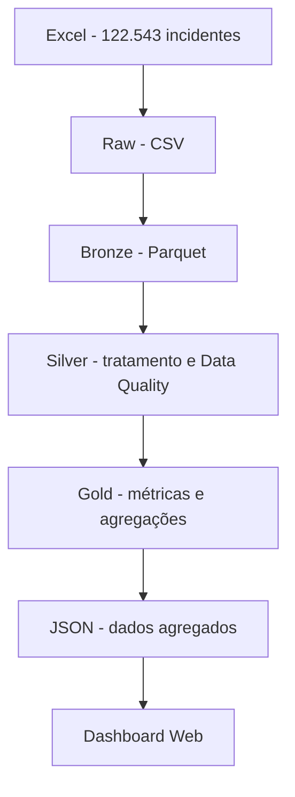

# PySpark IT Incident ETL

[](https://github.com/tecStudent/pyspark-it-incident-etl/actions/workflows/ci.yml)

Pipeline ETL local desenvolvido com **PySpark**, **Apache Spark 4.1.2** e **Docker** para processamento e análise de dados de incidentes de TI.

O projeto utiliza um dataset acadêmico do Enterprise Challenge da FIAP, no contexto do desafio com a Locaweb, e foi estruturado como um projeto de portfólio de Engenharia de Dados.

O pipeline processa **122.543 incidentes** desde um arquivo Excel bruto até tabelas analíticas na camada Gold e disponibiliza os principais indicadores em um dashboard web interativo.

## Arquitetura



### Raw

- Origem em `.xlsx`.
- Extração em modo `read_only` para reduzir consumo de memória.
- Conversão para CSV preservando os dados de origem.
- Dataset completo mantido apenas localmente e excluído do Git.

### Bronze

- Leitura com PySpark.
- Schema explícito com 19 campos de origem.
- Dados preservados inicialmente como `StringType`.
- Inclusão de metadados de ingestão.
- Validação da quantidade de registros entre origem e destino.
- Persistência em Apache Parquet.

### Silver

- Padronização dos nomes das colunas.
- Tratamento de strings vazias e valores nulos.
- Conversão de timestamps, números e booleanos.
- Separação do código e descrição da prioridade.
- Regras de Data Quality.
- Deduplicação utilizando `Window` e `row_number()`.
- Particionamento físico por ano e mês de abertura.
- Persistência em Apache Parquet.

### Gold

São geradas quatro tabelas analíticas:

| Tabela | Finalidade |
| --- | --- |
| `monthly_kpis` | Volume mensal, origem dos incidentes, KPI, média e P95 de duração |
| `priority_summary` | Indicadores agregados por prioridade |
| `team_summary` | Volume e indicadores de KPI por equipe |
| `dashboard_summary` | Agregação multidimensional por período, prioridade e equipe para consumo do dashboard |

As agregações utilizam recursos como `groupBy`, `agg`, agregações condicionais, `avg` e `percentile_approx`.

## Dashboard

O projeto inclui um dashboard web estático para visualização dos indicadores gerados pelo pipeline.

O dashboard consome somente dados agregados da camada Gold exportados para JSON, sem expor o dataset bruto.

### Indicadores

- Total de incidentes.
- Incidentes considerados no KPI.
- Violações de KPI.
- Percentual de compliance.
- Evolução mensal de incidentes.
- Distribuição por prioridade.
- Volume por equipe.

### Filtros interativos

Os indicadores e gráficos podem ser filtrados simultaneamente por:

- ano;
- mês;
- prioridade;
- equipe.

O dashboard foi desenvolvido com HTML, CSS, JavaScript e Chart.js e pode ser hospedado como site estático.

## Resultados da execução

Uma execução completa de referência processou:

| Métrica | Resultado |
| --- | ---: |
| Registros extraídos | 122.543 |
| Registros Bronze | 122.543 |
| Registros Silver | 122.543 |
| Duplicidades encontradas | 0 |
| Registros estruturalmente inválidos | 0 |
| Agregações mensais | 36 |
| Prioridades | 5 |
| Equipes | 17 |
| Registros agregados para o dashboard | 683 |
| Incidentes considerados no KPI | 25.600 |
| Violações de KPI | 248 |
| Compliance geral | 99,03% |
| Testes automatizados | 5 passed |

Na execução local de referência, o pipeline de processamento até a camada Gold terminou em aproximadamente **128 segundos**. Esse tempo depende dos recursos disponíveis no computador e no Docker.

## Tecnologias

- Apache Spark 4.1.2
- PySpark
- Python
- OpenJDK 21
- Apache Parquet
- Docker
- Docker Compose
- Pytest
- OpenPyXL
- HTML5
- CSS3
- JavaScript
- Chart.js
- Git e GitHub
- GitHub Pages

## Estrutura do projeto

```text
pyspark-it-incident-etl/
|-- data/
|   |-- raw/              # dados locais, ignorados pelo Git
|   |-- bronze/           # Parquet Bronze, ignorado pelo Git
|   |-- silver/           # Parquet Silver, ignorado pelo Git
|   |-- gold/             # Parquet Gold, ignorado pelo Git
|   `-- sample/
|-- src/
|   |-- extract_xlsx.py
|   |-- bronze.py
|   |-- silver.py
|   |-- gold.py
|   |-- export_dashboard.py
|   |-- pipeline.py
|   `-- test_spark.py
|-- tests/
|   |-- conftest.py
|   `-- test_silver.py
|-- docs/
|   |-- index.html
|   |-- css/
|   |   `-- style.css
|   |-- js/
|   |   `-- app.js
|   `-- data/
|       |-- dashboard_summary.json
|       |-- monthly_kpis.json
|       |-- priority_summary.json
|       `-- team_summary.json
|-- .gitignore
|-- Dockerfile
|-- docker-compose.yml
|-- README.md
`-- requirements.txt
```

## Pré-requisitos

É necessário ter apenas:

- Git
- Docker Desktop
- Docker Compose

Java, Spark e PySpark não precisam ser instalados diretamente no Windows. O ambiente de processamento é fornecido pelo container Docker.

## Dataset

O dataset completo não é versionado no repositório.

Para executar o pipeline, coloque o arquivo:

```text
LW-DATASET.xlsx
```

em:

```text
data/raw/LW-DATASET.xlsx
```

O pipeline utiliza a aba `Dataset Geral`.

## Como executar

### 1. Construir o ambiente

Na raiz do projeto:

```bash
docker compose build
```

### 2. Executar o pipeline completo

```bash
docker compose run --rm spark python3 src/pipeline.py
```

Esse único comando executa sequencialmente:

```text
Extract -> Bronze -> Silver -> Gold -> Dashboard
```

A última etapa exporta as agregações analíticas para arquivos JSON consumidos pelo dashboard.

As etapas de processamento utilizam escrita com `mode("overwrite")`, permitindo reexecuções sem simplesmente acumular os resultados da execução anterior.

## Continuar a partir de uma etapa

O runner permite reiniciar o processamento a partir de uma camada específica.

Continuar da Bronze:

```bash
docker compose run --rm spark python3 src/pipeline.py --from-stage bronze
```

Continuar da Silver:

```bash
docker compose run --rm spark python3 src/pipeline.py --from-stage silver
```

Executar novamente a Gold e, em seguida, atualizar os dados do dashboard:

```bash
docker compose run --rm spark python3 src/pipeline.py --from-stage gold
```

Executar somente a exportação dos dados do dashboard:

```bash
docker compose run --rm spark python3 src/pipeline.py --from-stage dashboard
```

Isso permite interromper o desenvolvimento e continuar posteriormente sem precisar obrigatoriamente reexecutar todas as etapas anteriores.

## Como interromper

Durante uma execução, pressione:

```text
Ctrl + C
```

O container temporário é executado com `--rm` e é removido após o encerramento.

Se algum serviço tiver sido iniciado com `docker compose up`, utilize:

```bash
docker compose down
```

Os códigos e os dados locais permanecem no diretório do projeto.

## Executar o dashboard localmente

Após gerar os dados, execute na raiz do projeto:

```bash
python -m http.server 8000 --directory docs
```

Acesse no navegador:

```text
http://localhost:8000
```

Para encerrar o servidor:

```text
Ctrl + C
```

O dashboard é estático e consome os arquivos JSON gerados a partir das agregações da camada Gold.

## Executar uma camada individualmente

Bronze:

```bash
MSYS_NO_PATHCONV=1 docker compose run --rm spark /opt/spark/bin/spark-submit --master "local[4]" src/bronze.py
```

Silver:

```bash
MSYS_NO_PATHCONV=1 docker compose run --rm spark /opt/spark/bin/spark-submit --master "local[4]" src/silver.py
```

Gold:

```bash
MSYS_NO_PATHCONV=1 docker compose run --rm spark /opt/spark/bin/spark-submit --master "local[4]" src/gold.py
```

`MSYS_NO_PATHCONV=1` é utilizado nos comandos acima por compatibilidade com Git Bash no Windows ao passar caminhos Linux para o container.

## Testes automatizados

Execute:

```bash
docker compose run --rm spark python3 -m pytest -q
```

Resultado esperado:

```text
..... [100%]
10 passed
```

## Integração contínua

O projeto utiliza GitHub Actions para validar automaticamente cada Pull Request direcionado à branch `main`.

O workflow:

- constrói a imagem Docker do Apache Spark;
- prepara o ambiente de execução;
- executa os testes com Pytest;
- impede que alterações com testes quebrados sejam incorporadas sem identificação.

A mesma suíte pode ser executada localmente:

```bash
docker compose run --rm spark python3 -m pytest -q

Os testes verificam:

- limpeza e tipagem;
- conversão dos indicadores de KPI;
- registros válidos e inválidos nas regras de Data Quality;
- tratamento de `N/A` nos indicadores;
- deduplicação com `Window`.

## Data Quality

A Silver valida aspectos estruturais como:

- identificador do incidente;
- faixa válida de prioridade;
- presença da equipe responsável;
- timestamps de abertura e encerramento;
- duração nula ou negativa;
- encerramento anterior à abertura.

O dataset também contém campos de negócio `Entrou para KPI?` e `KPI Violado?`. Esses indicadores são preservados como fonte de negócio na Gold. As regras documentadas de duração podem ser utilizadas para auditorias adicionais sem sobrescrever automaticamente os flags fornecidos pela origem.

## Conceitos demonstrados

O projeto foi desenvolvido para exercitar práticas de Engenharia de Dados com PySpark, incluindo:

- ETL em camadas Raw, Bronze, Silver e Gold;
- schema explícito;
- Apache Parquet;
- `withColumn` e `when`;
- tratamento de nulos;
- conversão de tipos;
- expressões regulares;
- funções de data;
- `Window` e `row_number`;
- deduplicação;
- Data Quality;
- particionamento;
- `groupBy` e `agg`;
- agregações condicionais;
- percentil aproximado (P95);
- criação de Data Mart para consumo analítico;
- exportação de agregações para JSON;
- integração entre pipeline de dados e camada de visualização;
- dashboard interativo com filtros;
- visualização de dados com JavaScript e Chart.js;
- testes automatizados com Pytest;
- execução reproduzível com Docker;
- reexecução e retomada por etapa.

## Possíveis evoluções

- Simular ingestão incremental por lotes.
- Adicionar testes para Bronze e Gold.
- Criar auditoria específica das regras documentadas de KPI/SLA.
- Adicionar CI com GitHub Actions.
- Integrar o pipeline a um orquestrador como Apache Airflow.
- Evoluir o armazenamento para formatos de tabela como Apache Iceberg ou Delta Lake.

## Contexto acadêmico

Este projeto reutiliza o contexto acadêmico do Enterprise Challenge da FIAP para construir um pipeline local de Engenharia de Dados voltado ao portfólio técnico. O dataset completo e as saídas intermediárias processadas permanecem fora do versionamento do Git. O dashboard utiliza somente dados analíticos agregados gerados pelo pipeline.
