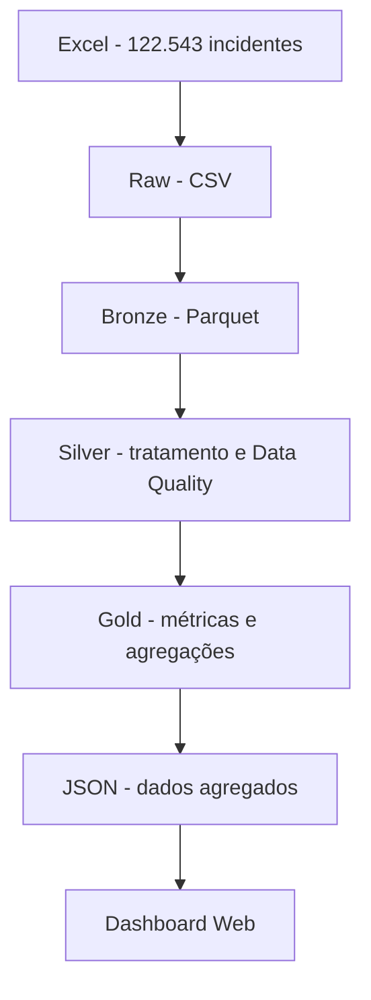
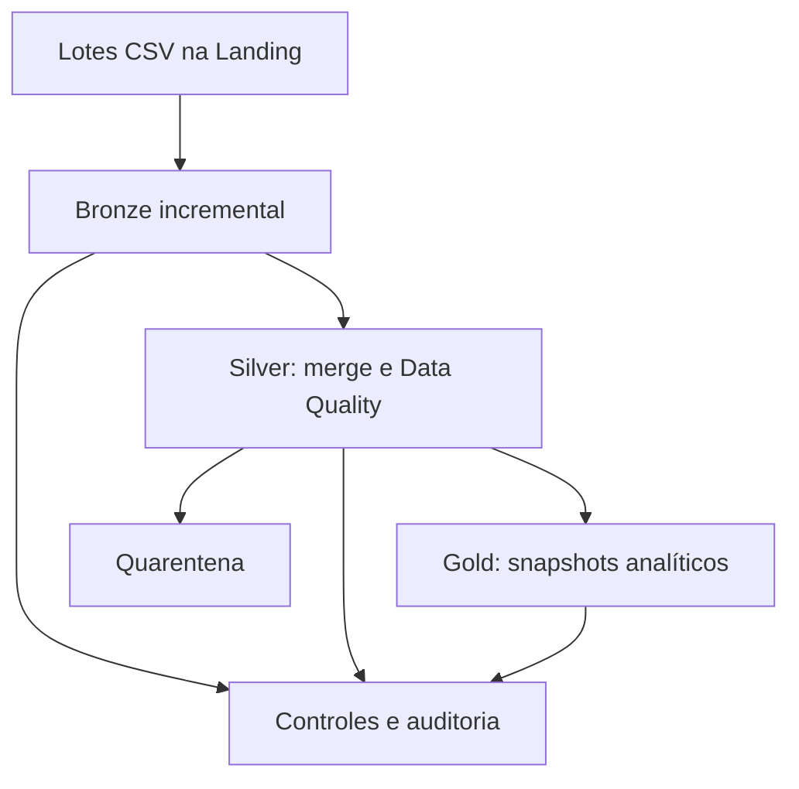

# PySpark IT Incident ETL

[](https://github.com/tecStudent/pyspark-it-incident-etl/actions/workflows/ci.yml)

Pipeline local de Engenharia de Dados desenvolvido com **PySpark**, **Apache Spark 4.1.2** e **Docker** para processamento e análise de incidentes de TI.

O projeto utiliza um dataset acadêmico do Enterprise Challenge da FIAP, no contexto do desafio com a Locaweb, e demonstra dois modos de processamento:

- carga completa em camadas Raw, Bronze, Silver e Gold;
- carga incremental idempotente, com controle de batches, deduplicação, quarentena e auditoria.

A carga completa processa **122.543 incidentes** e disponibiliza os principais indicadores em um dashboard web interativo.

[Acessar o dashboard publicado no GitHub Pages](https://tecstudent.github.io/pyspark-it-incident-etl/)

## Arquitetura da carga completa



### Raw

- Origem em `.xlsx`.
- Extração em modo `read_only` para reduzir o consumo de memória.
- Conversão para CSV preservando os dados de origem.
- Dataset completo mantido apenas localmente e excluído do Git.

### Bronze

- Leitura com PySpark.
- Schema explícito com 19 campos de origem.
- Dados preservados inicialmente como `StringType`.
- Inclusão de metadados de ingestão.
- Validação da quantidade de registros entre origem e destino.
- Persistência em Apache Parquet.

### Silver

- Padronização dos nomes das colunas.
- Tratamento de strings vazias e valores nulos.
- Conversão de timestamps, números e booleanos.
- Separação do código e descrição da prioridade.
- Regras de Data Quality.
- Deduplicação utilizando `Window` e `row_number()`.
- Particionamento físico por ano e mês de abertura.
- Persistência em Apache Parquet.

### Gold

São geradas quatro tabelas analíticas:

| Tabela | Finalidade |
| --- | --- |
| `monthly_kpis` | Volume mensal, origem dos incidentes, KPI, média e P95 de duração |
| `priority_summary` | Indicadores agregados por prioridade |
| `team_summary` | Volume e indicadores de KPI por equipe |
| `dashboard_summary` | Agregação multidimensional por período, prioridade e equipe para consumo do dashboard |

As agregações utilizam recursos como `groupBy`, `agg`, agregações condicionais, `avg` e `percentile_approx`.

## Arquitetura incremental



O fluxo incremental simula a chegada mensal de novos arquivos e processa apenas batches ainda não aplicados.

### Landing

- Recebe arquivos CSV incrementais.
- Cada arquivo representa um lote independente.
- Os lotes podem ser adicionados sem reconstruir a carga histórica completa.

### Bronze incremental

- Calcula o hash SHA-256 de cada arquivo.
- Utiliza o hash para gerar um `batch_id` determinístico.
- Registra arquivo, hash, quantidade e status do processamento.
- Ignora arquivos já processados com sucesso.
- Mantém os batches em diretórios Parquet independentes.

### Silver incremental

- Aplica as mesmas transformações e regras da Silver completa.
- Combina os novos dados com o estado Silver existente.
- Deduplica registros pela identificação do incidente.
- Mantém a versão mais recente de cada incidente.
- Separa registros válidos e inválidos.
- Preserva os registros anteriores da quarentena.
- Substitui os diretórios de saída utilizando staging e backup.

### Gold incremental

- Processa somente quando existem batches Silver pendentes.
- Recalcula snapshots analíticos a partir do estado Silver atual.
- Gera resumos mensais, por prioridade, por equipe e para o dashboard.
- Registra quais batches já foram refletidos na Gold.

### Idempotência e controles

Os controles locais ficam em `data/control/`:

| Controle | Finalidade |
| --- | --- |
| `processed_batches.json` | Batches processados na Bronze |
| `silver_batches.json` | Batches incorporados à Silver |
| `gold_batches.json` | Batches refletidos nos snapshots Gold |
| `pipeline_runs.json` | Histórico e resultado das execuções do runner |

Uma reexecução sem novos arquivos não duplica registros nem reprocessa batches concluídos.

### Auditoria

Cada execução do pipeline incremental registra:

- identificador único da execução;
- horário de início e término;
- duração total e por etapa;
- status `SUCCESS`, `FAILED` ou `INTERRUPTED`;
- etapa em que ocorreu uma possível falha;
- exit code e mensagem de erro;
- totais observados nos controles Bronze, Silver e Gold;
- quantidade atual de registros em quarentena.

## Dashboard

O projeto inclui um dashboard web estático para visualização dos indicadores gerados pelo pipeline completo.

O dashboard consome somente dados agregados da camada Gold exportados para JSON, sem expor o dataset bruto.

### Indicadores

- Total de incidentes.
- Incidentes considerados no KPI.
- Violações de KPI.
- Percentual de compliance.
- Evolução mensal de incidentes.
- Distribuição por prioridade.
- Volume por equipe.

### Filtros interativos

Os indicadores e gráficos podem ser filtrados simultaneamente por:

- ano;
- mês;
- prioridade;
- equipe.

O dashboard foi desenvolvido com HTML, CSS, JavaScript e Chart.js e está publicado gratuitamente no GitHub Pages.

## Resultados da carga completa

| Métrica | Resultado |
| --- | ---: |
| Registros extraídos | 122.543 |
| Registros Bronze | 122.543 |
| Registros Silver | 122.543 |
| Duplicidades encontradas | 0 |
| Registros estruturalmente inválidos | 0 |
| Agregações mensais | 36 |
| Prioridades | 5 |
| Equipes | 17 |
| Registros agregados para o dashboard | 683 |
| Incidentes considerados no KPI | 25.600 |
| Violações de KPI | 248 |
| Compliance geral | 99,03% |
| Testes automatizados | 10 passed |

Na execução local de referência, o pipeline completo até a camada Gold terminou em aproximadamente **128 segundos**. Esse tempo depende dos recursos disponíveis no computador e no Docker.

## Validação incremental de referência

| Métrica | Resultado |
| --- | ---: |
| Batches processados | 5 |
| Registros recebidos na Bronze | 36 |
| Registros válidos na Silver | 34 |
| Registros em quarentena | 1 |
| Duplicidades removidas | 1 |
| Registros no snapshot Gold | 34 |
| Reexecução sem novos dados | Nenhum batch reprocessado |

O conjunto de validação inclui duas versões do mesmo incidente e um registro propositalmente inválido, comprovando a deduplicação e o direcionamento para quarentena.

## Tecnologias

- Apache Spark 4.1.2
- PySpark
- Python
- OpenJDK 21
- Apache Parquet
- Docker
- Docker Compose
- Pytest
- OpenPyXL
- HTML5
- CSS3
- JavaScript
- Chart.js
- Git e GitHub
- GitHub Actions
- GitHub Pages

## Estrutura do projeto

```text
pyspark-it-incident-etl/
|-- .github/
|   `-- workflows/
|       `-- ci.yml
|-- data/
|   |-- raw/                  # origem e batches locais
|   |-- landing/              # entrada dos lotes incrementais
|   |-- control/              # controles e auditoria locais
|   |-- bronze/               # Parquet Bronze
|   |-- silver/               # Parquet Silver
|   |-- gold/                 # Parquet Gold
|   |-- quarantine/           # registros inválidos
|   `-- sample/               # fixture incremental versionada
|-- src/
|   |-- extract_xlsx.py
|   |-- bronze.py
|   |-- silver.py
|   |-- gold.py
|   |-- export_dashboard.py
|   |-- pipeline.py
|   |-- create_incremental_batches.py
|   |-- incremental_bronze.py
|   |-- incremental_silver.py
|   |-- incremental_gold.py
|   |-- incremental_pipeline.py
|   `-- pipeline_audit.py
|-- tests/
|   |-- conftest.py
|   |-- test_silver.py
|   `-- test_pipeline_audit.py
|-- docs/
|   |-- index.html
|   |-- css/
|   |   `-- style.css
|   |-- js/
|   |   `-- app.js
|   `-- data/
|       |-- dashboard_summary.json
|       |-- monthly_kpis.json
|       |-- priority_summary.json
|       `-- team_summary.json
|-- .gitignore
|-- Dockerfile
|-- docker-compose.yml
|-- README.md
`-- requirements.txt
```

Os diretórios de dados processados e os arquivos de controle permanecem fora do versionamento.

## Pré-requisitos

É necessário ter apenas:

- Git
- Docker Desktop
- Docker Compose

Java, Spark e PySpark não precisam ser instalados diretamente no Windows. O ambiente de processamento é fornecido pelo container Docker.

## Dataset

O dataset completo não é versionado no repositório.

Para executar a carga completa, coloque o arquivo `LW-DATASET.xlsx` em:

```text
data/raw/LW-DATASET.xlsx
```

O pipeline utiliza a aba `Dataset Geral`.

## Construir o ambiente

Na raiz do projeto:

```bash
docker compose build
```

## Executar a carga completa

```bash
docker compose run --rm spark python3 src/pipeline.py
```

Esse comando executa:

```text
Extract -> Bronze -> Silver -> Gold -> Dashboard
```

A última etapa exporta as agregações analíticas para os arquivos JSON consumidos pelo dashboard.

As etapas utilizam escrita com `mode("overwrite")`, permitindo reexecuções sem acumular os resultados anteriores.

### Retomar a carga completa por etapa

```bash
# Continuar da Bronze
docker compose run --rm spark python3 src/pipeline.py --from-stage bronze

# Continuar da Silver
docker compose run --rm spark python3 src/pipeline.py --from-stage silver

# Executar Gold e atualizar os dados do dashboard
docker compose run --rm spark python3 src/pipeline.py --from-stage gold

# Executar somente a exportação do dashboard
docker compose run --rm spark python3 src/pipeline.py --from-stage dashboard
```

## Executar o pipeline incremental

### 1. Gerar os lotes de demonstração

Depois de gerar `data/raw/incidents.csv` pela extração da carga completa:

```bash
docker compose run --rm spark python3 src/create_incremental_batches.py
```

Os arquivos mensais serão criados em `data/raw/batches/`.

### 2. Adicionar um lote à Landing

Exemplo:

```bash
cp data/raw/batches/incidents_2023_01.csv data/landing/
```

### 3. Executar Bronze, Silver e Gold incrementais

```bash
docker compose run --rm spark python3 src/incremental_pipeline.py
```

### Retomar o pipeline incremental por etapa

```bash
# Continuar da Silver
docker compose run --rm spark python3 src/incremental_pipeline.py --from-stage silver

# Executar somente a Gold incremental
docker compose run --rm spark python3 src/incremental_pipeline.py --from-stage gold
```

O runner grava o resultado de todas as execuções em `data/control/pipeline_runs.json`.

### Conferir a última auditoria

```bash
docker compose run --rm spark python3 -c \
'import json; data=json.load(open("data/control/pipeline_runs.json", encoding="utf-8")); print(json.dumps(data["runs"][-1], indent=2, ensure_ascii=False))'
```

## Como interromper

Durante uma execução, pressione:

```text
Ctrl + C
```

O container temporário é executado com `--rm` e removido após o encerramento.

Se algum serviço tiver sido iniciado com `docker compose up`, utilize:

```bash
docker compose down
```

Os códigos e dados locais permanecem no diretório do projeto.

## Executar o dashboard localmente

Após gerar os dados:

```bash
python -m http.server 8000 --directory docs
```

Acesse:

```text
http://localhost:8000
```

Para encerrar o servidor, pressione `Ctrl + C`.

## Executar uma camada completa individualmente

```bash
# Bronze
MSYS_NO_PATHCONV=1 docker compose run --rm spark /opt/spark/bin/spark-submit --master "local[4]" src/bronze.py

# Silver
MSYS_NO_PATHCONV=1 docker compose run --rm spark /opt/spark/bin/spark-submit --master "local[4]" src/silver.py

# Gold
MSYS_NO_PATHCONV=1 docker compose run --rm spark /opt/spark/bin/spark-submit --master "local[4]" src/gold.py
```

`MSYS_NO_PATHCONV=1` é utilizado por compatibilidade com Git Bash no Windows ao passar caminhos Linux para o container.

## Testes automatizados

Execute:

```bash
docker compose run --rm spark python3 -m pytest -q
```

Resultado atual:

```text
.......... [100%]
10 passed
```

Os testes verificam:

- limpeza e tipagem;
- conversão dos indicadores de KPI;
- registros válidos e inválidos nas regras de Data Quality;
- tratamento de `N/A` nos indicadores;
- deduplicação com `Window`;
- leitura e consolidação dos controles incrementais;
- cálculo do snapshot de auditoria;
- criação e preservação do histórico de execuções.

## Integração contínua

O projeto utiliza GitHub Actions para validar automaticamente cada Pull Request direcionado à branch `main`.

O workflow:

- utiliza `actions/checkout@v5`;
- constrói a imagem Docker do Apache Spark;
- executa os 10 testes com Pytest;
- possui permissão somente de leitura no repositório;
- cancela execuções anteriores quando uma nova versão do mesmo PR é enviada.

O workflow também pode ser iniciado manualmente pela aba **Actions** do GitHub.

## Data Quality

A Silver valida aspectos estruturais como:

- identificador do incidente;
- faixa válida de prioridade;
- presença da equipe responsável;
- timestamps de abertura e encerramento;
- duração nula ou negativa;
- encerramento anterior à abertura.

Registros inválidos do fluxo incremental são preservados em `data/quarantine/incidents` junto com os motivos encontrados em `dq_issues`.

Os campos de negócio `Entrou para KPI?` e `KPI Violado?` são mantidos como fonte de negócio na Gold. As regras documentadas de duração podem ser utilizadas para auditorias adicionais sem sobrescrever automaticamente os indicadores fornecidos pela origem.

## Conceitos demonstrados

- ETL em camadas Raw, Bronze, Silver e Gold;
- schema explícito;
- Apache Parquet e particionamento;
- transformações com `withColumn` e `when`;
- tratamento de nulos e conversão de tipos;
- expressões regulares e funções de data;
- `Window` e `row_number`;
- deduplicação e Data Quality;
- `groupBy`, `agg` e agregações condicionais;
- percentil aproximado (P95);
- carga incremental por batches;
- idempotência por hash SHA-256;
- merge de estado incremental;
- quarentena de registros inválidos;
- controles por camada;
- auditoria de execuções;
- criação de Data Mart para consumo analítico;
- exportação de agregações para JSON;
- dashboard interativo com JavaScript e Chart.js;
- testes automatizados com Pytest;
- integração contínua com GitHub Actions;
- execução reproduzível com Docker;
- reexecução e retomada por etapa.

## Possíveis evoluções

- Adicionar testes específicos para Bronze e Gold.
- Publicar métricas de cobertura de testes.
- Criar auditoria específica das regras documentadas de KPI/SLA.
- Integrar o pipeline a um orquestrador como Apache Airflow.
- Evoluir o armazenamento para Apache Iceberg ou Delta Lake.
- Publicar imagens Docker versionadas no GitHub Container Registry.

## Contexto acadêmico

Este projeto reutiliza o contexto acadêmico do Enterprise Challenge da FIAP para construir um pipeline local de Engenharia de Dados voltado ao portfólio técnico. O dataset completo, os arquivos de controle e as saídas intermediárias permanecem fora do versionamento. O dashboard utiliza somente dados analíticos agregados gerados pelo pipeline.
